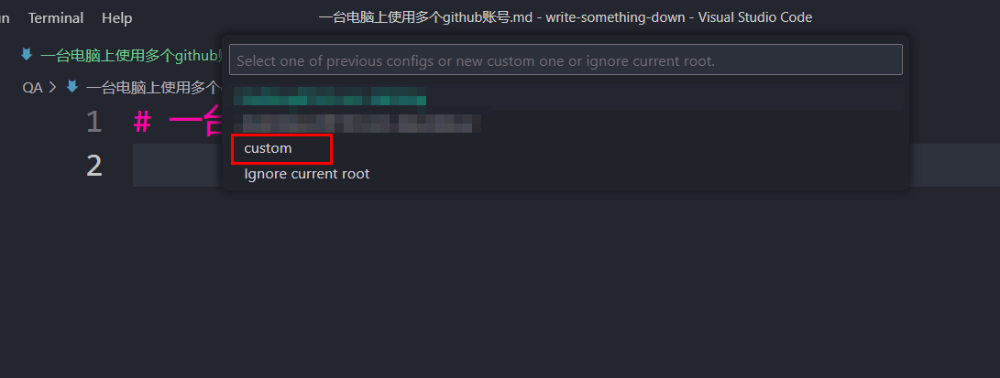

# 一台电脑上使用多个 github 账号

因为换号频繁，所以一台电脑上需要配置多个 github 账号，然而每次都是要配置的时候才去查一下怎么配。😅 所以这次特别记录一下，下次就不用单独去查啦。

## 步骤

### 本地电脑上生成新账号的 SSH key

```
ssh-keygen -t rsa -C "newemail@163.com"
```

第一次停顿：输入文件名 id_rsa_newemail 后回车，
后面两次停顿直接回车。

### 修改 config 文件

在`.ssh`目录下的`config`文件中添加新的账号信息

```
# newemail(newemail@163.com)

Host newemail
HostName github.com
User newemail
PreferredAuthentications publickey
IdentityFile ~/.ssh/id_rsa_newemail
```

### github 配置 SSH

登录新账号，在设置中添加 SSH key，将前面生成的.pub 公钥复制添加即可。

测试是否成功添加：

```
ssh -T git@newemail
```

`newemail`为之前 config 中的 Host 值


### 新账号上传代码

#### 设置本地仓库的用户名和密码

vscode 里确保先安装了`git-autoconfig`插件。

新建一个文件夹后执行`git init`生成本地仓库。

`git-autoconfig`会让你设置当前仓库的局部用户名和邮箱。
点击 custom 添加新账号信息，只需一次设置，之后再创建新仓库时就可以直接选择之前的用户信息了。


#### 连接远程仓库

使用 SSH 格式，将 `git@github.com`的`github.com` 换为新账号的 Host 值

```
git remote add origin git@newemail:xxx.git
```

## 参考

- [悦创-一台电脑上的 git 同时使用两个 github 账户](https://blog.51cto.com/aiyc/5151146)：详细版 建议配置看这个
